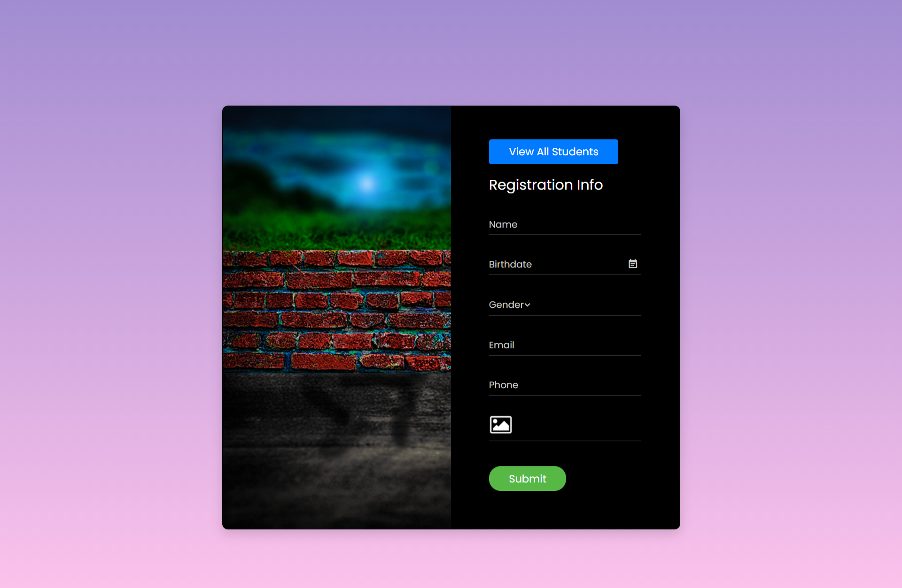
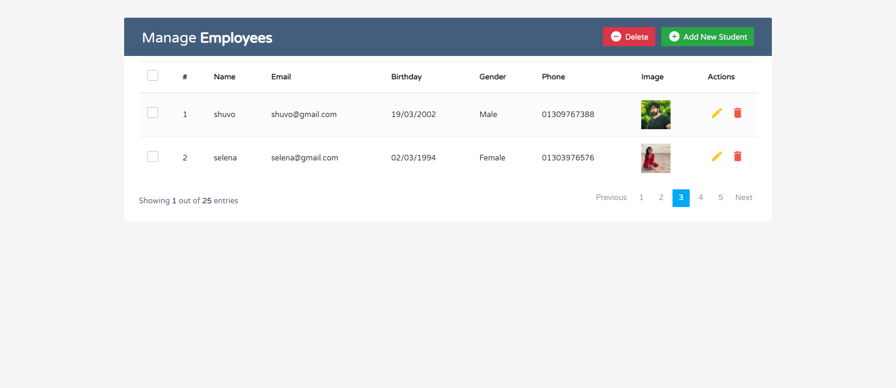

<h1>Practice file raw PHP<h1>

 This file using  educational Purpose

<h3> All assignments are created With the help of PHP and OOP </h3>

Form Validation

View All Data

- [Our facebook Page](https://web.facebook.com/saresearchlab/)
- [Our Website](https://saresearchlab.moudutshuvo.com/)

	<h2 style="text-align: center;color: green;">Thank You</h2>
